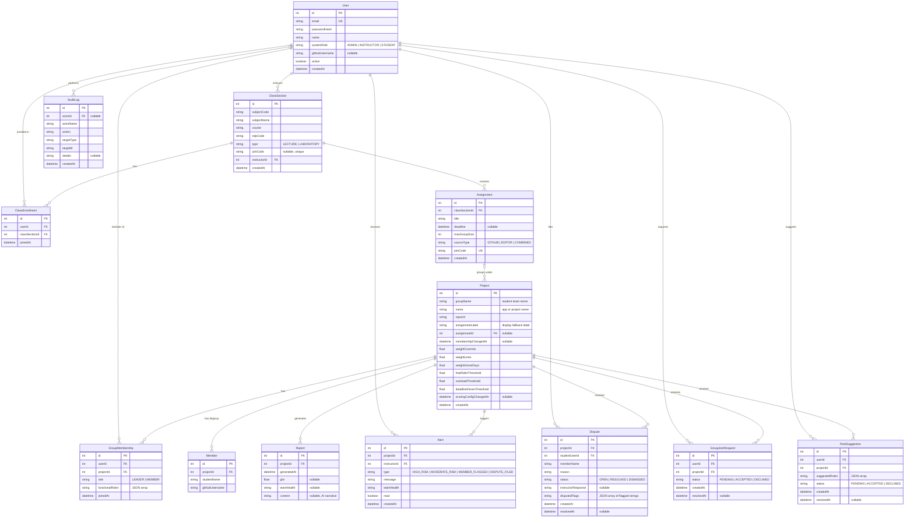

# FairTraze AI — Database Design

## Overview

The database stores everything needed for an instructor to set up group projects, collect student team information, run a GitHub contribution analysis, and review the results — including any disputes or audit activity.

The core hierarchy is:

- A **User** (admin, instructor, or student) owns an account with a system role.
- An **instructor** creates **ClassSections** (course sections), each of which can have many **Assignments** (projects for groups to work on).
- **Students** enroll in a ClassSection via a join code, then join a **Project** (a student team/group) via the Assignment's join code.
- Each **Project** holds two overlapping member representations:
  - **GroupMembership** — links an authenticated User account to the Project (Phase B, the current model). Carries the member's role (LEADER or MEMBER) and functional roles (e.g., Developer).
  - **Member** — legacy flat record storing a name and GitHub username directly on the project, used before auth-linked membership was introduced.
- Running the GitHub analyzer produces a **Report** for the project.
- **Alerts** are raised for instructors when a report flags risk. **Disputes** are filed by students contesting their flags. **AuditLogs** record system-wide actions. **GroupJoinRequests** and **RoleSuggestions** handle pending student actions.

---

## Entity Relationship Diagram (ERD)

---

## Table-by-Table Reference

### `User`

Represents any system account — an admin, an instructor, or a student.

| Field | Type | Description |
|---|---|---|
| `id` | Int (PK) | Auto-increment primary key. |
| `email` | String (unique) | Login email address. Must be unique across all users. |
| `passwordHash` | String | bcrypt hash of the user's password. Never stored in plain text. |
| `name` | String | Display name. |
| `systemRole` | Enum | `ADMIN`, `INSTRUCTOR`, or `STUDENT`. Controls which parts of the UI and API the user can access. |
| `githubUsername` | String? | Optional. The user's GitHub handle. Used to match GitHub commit activity to this account during analysis. |
| `active` | Boolean | Whether the account is active. Defaults to `true`. Soft-disable without deletion. |
| `createdAt` | DateTime | When the account was created. |

**Unique constraints:** `email`

---

### `ClassSection`

A course section created by an instructor (e.g., "CC-APPSDEV22 — Applications Development, BSIT 3A").

| Field | Type | Description |
|---|---|---|
| `id` | Int (PK) | Auto-increment primary key. |
| `subjectCode` | String | Subject code (e.g., `CC-APPSDEV22`). |
| `subjectName` | String | Full subject name (e.g., `Applications Development`). |
| `course` | String | Degree program (e.g., `BSIT`). Defaults to `"BSIT"`. |
| `edpCode` | String | EDP code identifying the section. Defaults to `""`. |
| `type` | Enum | `LECTURE` or `LABORATORY`. |
| `joinCode` | String? | Optional unique code students use to enroll in this class section. |
| `instructorId` | Int (FK → User) | The instructor who owns this class. |
| `createdAt` | DateTime | When the section was created. |

**Unique constraints:** `joinCode`; composite `(instructorId, edpCode)` so the same instructor cannot have two sections with the same EDP code.

---

### `ClassEnrollment`

Records that a student is enrolled in a specific class section. Many-to-many bridge between `User` and `ClassSection`.

| Field | Type | Description |
|---|---|---|
| `id` | Int (PK) | Auto-increment primary key. |
| `userId` | Int (FK → User) | The enrolled student. |
| `classSectionId` | Int (FK → ClassSection) | The class they enrolled in. |
| `joinedAt` | DateTime | When the student joined the class. |

**Unique constraints:** `(userId, classSectionId)` — a student cannot be enrolled twice in the same class.

---

### `Assignment`

An instructor-created assignment within a ClassSection. Students use the assignment's join code to create or join a group.

| Field | Type | Description |
|---|---|---|
| `id` | Int (PK) | Auto-increment primary key. |
| `classSectionId` | Int (FK → ClassSection) | The class this assignment belongs to. |
| `title` | String | Name of the assignment (e.g., "Final Project"). |
| `deadline` | DateTime? | Optional submission deadline. Used to anchor the deadline-driven flag window. |
| `maxGroupSize` | Int | Maximum members per group. Defaults to `5`. |
| `sourceType` | Enum | `GITHUB`, `EDITOR`, or `COMBINED`. Determines what data sources the analysis uses. |
| `joinCode` | String (unique) | Code students enter to create or join a group for this assignment. |
| `createdAt` | DateTime | When the assignment was created. |

**Unique constraints:** `joinCode`

---

### `Project`

A student group/team working on a specific assignment. This is the central entity — almost everything else links to it. It holds both the group's identity and its per-project scoring configuration.

> **Note:** In the target architecture (see CLAUDE.md), this table is planned to be renamed `Group`. The name `Project` reflects the prototype's origin as a flat, assignment-free structure.

| Field | Type | Description |
|---|---|---|
| `id` | Int (PK) | Auto-increment primary key. |
| `groupName` | String | The student team name (e.g., "Group 1"). Primary identifier shown on the dashboard. Defaults to `""`. |
| `name` | String | The app or project the team is building (e.g., "FairTraze AI"). |
| `repoUrl` | String | GitHub repository URL the group's code lives in. |
| `assignmentLabel` | String | Display fallback label (e.g., "CC-APPSDEV22 — Applications Development"). Used when a project pre-dates the Assignment model. Defaults to `""`. |
| `assignmentId` | Int? (FK → Assignment) | Optional link to a formal Assignment. Null for legacy projects created before Phase B. |
| `membershipChangedAt` | DateTime? | Updated whenever a member joins or leaves. Compared against the latest report's timestamp to detect staleness. |
| `weightCommits` | Float | Scoring weight for commit count. Defaults to `0.4`. |
| `weightLines` | Float | Scoring weight for meaningful lines. Defaults to `0.4`. |
| `weightActiveDays` | Float | Scoring weight for active days. Defaults to `0.2`. |
| `freeRiderThreshold` | Float | Below this share of equal share → free-rider flag. Defaults to `0.5`. |
| `overloadThreshold` | Float | Above this multiple of equal share → overload flag. Defaults to `1.75`. |
| `deadlineDrivenThreshold` | Float | Fraction of commits in final third → deadline-driven flag. Defaults to `0.6`. |
| `scoringConfigChangedAt` | DateTime? | Set when scoring config is changed after the last analysis; cleared when re-analysis runs. Signals a stale report. |
| `createdAt` | DateTime | When the group was created. |

---

### `GroupMembership`

Links an authenticated User to a Project. This is the Phase B member model — replaces the legacy `Member` table for groups created through the join-code flow.

| Field | Type | Description |
|---|---|---|
| `id` | Int (PK) | Auto-increment primary key. |
| `userId` | Int (FK → User) | The user who is a member. |
| `projectId` | Int (FK → Project) | The project they belong to. |
| `role` | Enum | `LEADER` (created the group) or `MEMBER`. Exactly one LEADER per group at all times. No effect on scoring. |
| `functionalRoles` | String | JSON array of functional role strings (e.g., `["DEVELOPER"]`, `["DEVELOPER","DOCUMENTATION"]`). Context only — never affects the contribution score. Defaults to `["DEVELOPER"]`. |
| `joinedAt` | DateTime | When the user joined the group. |

**Unique constraints:** `(userId, projectId)` — a user can only be in a project once.

---

### `Member`

Legacy flat member record. Stores a student name and GitHub username directly against a project, without requiring an authenticated User account. Used by the prototype before Phase B auth-linked membership was introduced.

| Field | Type | Description |
|---|---|---|
| `id` | Int (PK) | Auto-increment primary key. |
| `projectId` | Int (FK → Project) | The project this member belongs to. |
| `studentName` | String | Display name (e.g., "Member A"). |
| `githubUsername` | String | GitHub handle used to match commits during analysis. |

> Both `Member` and `GroupMembership` can coexist for the same project. The analyzer reads from whichever is populated. New groups created via the join-code flow populate `GroupMembership` (sourcing `githubUsername` from `User.githubUsername`).

---

### `Report`

The output of one GitHub analysis run for a project. Stores the computed statistics and the AI-generated narrative.

| Field | Type | Description |
|---|---|---|
| `id` | Int (PK) | Auto-increment primary key. |
| `projectId` | Int (FK → Project) | The project this report is for. |
| `generatedAt` | DateTime | When the analysis was run. |
| `gini` | Float? | Gini coefficient (0–1) measuring contribution inequality across the team. Higher = more unequal. |
| `teamHealth` | String? | Computed health label: `"Healthy"`, `"Moderate Risk"`, or `"High Risk"`. |
| `content` | String? | Full AI-generated fairness narrative (plain text). Contains the Gemini-written explanation of the computed scores and flags. |

---

### `Alert`

A notification created for an instructor when an analysis produces a risk outcome or when a student files a dispute.

| Field | Type | Description |
|---|---|---|
| `id` | Int (PK) | Auto-increment primary key. |
| `projectId` | Int (FK → Project) | The group that triggered the alert. |
| `instructorId` | Int (FK → User) | The instructor to notify. |
| `type` | Enum | `HIGH_RISK`, `MODERATE_RISK`, `MEMBER_FLAGGED`, or `DISPUTE_FILED`. |
| `message` | String | Human-readable alert text. |
| `teamHealth` | String | Team health label at the time the alert was created. |
| `read` | Boolean | Whether the instructor has seen the alert. Defaults to `false`. |
| `createdAt` | DateTime | When the alert was raised. |

---

### `Dispute`

A student's contestation of their contribution flags for a specific project. The instructor reviews and resolves it.

| Field | Type | Description |
|---|---|---|
| `id` | Int (PK) | Auto-increment primary key. |
| `projectId` | Int (FK → Project) | The project the dispute relates to. |
| `studentUserId` | Int (FK → User) | The student who filed the dispute. |
| `memberName` | String | Display name of the disputing member at submission time (snapshot). |
| `reason` | String | The student's free-text explanation of why their flags are inaccurate. |
| `status` | Enum | `OPEN`, `RESOLVED`, or `DISMISSED`. |
| `instructorResponse` | String? | Optional instructor note when resolving or dismissing. |
| `disputedFlags` | String | JSON array of the specific flag strings being contested (e.g., `["free-rider"]`). Empty string `""` for records created before this field was added. |
| `createdAt` | DateTime | When the dispute was filed. |
| `resolvedAt` | DateTime? | When the instructor resolved or dismissed it. |

---

### `AuditLog`

An append-only record of significant actions taken in the system (e.g., member removed, role changed, report generated).

| Field | Type | Description |
|---|---|---|
| `id` | Int (PK) | Auto-increment primary key. |
| `actorId` | Int? (FK → User) | The user who performed the action. Nullable — set to `null` if the actor account is later deleted. |
| `actorName` | String | Snapshot of the actor's name at the time of the action (preserved even if the account is deleted). |
| `action` | String | Verb describing what was done (e.g., `"REMOVE_MEMBER"`, `"GENERATE_REPORT"`). |
| `targetType` | String | The entity type the action affected (e.g., `"Project"`, `"GroupMembership"`). |
| `targetId` | String | The ID of the affected entity as a string. |
| `details` | String? | Optional JSON blob with extra context. |
| `createdAt` | DateTime | When the action occurred. |

---

### `GroupJoinRequest`

A student's pending request to join a group. The group leader (or instructor) can accept or decline.

| Field | Type | Description |
|---|---|---|
| `id` | Int (PK) | Auto-increment primary key. |
| `userId` | Int (FK → User) | The student requesting to join. |
| `projectId` | Int (FK → Project) | The group they want to join. |
| `status` | Enum | `PENDING`, `ACCEPTED`, or `DECLINED`. |
| `createdAt` | DateTime | When the request was submitted. |
| `resolvedAt` | DateTime? | When the leader accepted or declined it. |

---

### `RoleSuggestion`

A student's suggestion for their own functional role within a group. Requires leader or instructor approval before taking effect.

| Field | Type | Description |
|---|---|---|
| `id` | Int (PK) | Auto-increment primary key. |
| `userId` | Int (FK → User) | The student making the suggestion. |
| `projectId` | Int (FK → Project) | The group this suggestion is for. |
| `suggestedRoles` | String | JSON array of the functional roles the student is suggesting for themselves (e.g., `["DEVELOPER","DOCUMENTATION"]`). |
| `status` | Enum | `PENDING`, `ACCEPTED`, or `DECLINED`. |
| `createdAt` | DateTime | When the suggestion was submitted. |
| `resolvedAt` | DateTime? | When the leader or instructor responded. |

---

## Relationships Explained

**Instructor → Class Sections**
One instructor (a User with `systemRole = INSTRUCTOR`) owns zero or more ClassSections. The `instructorId` on ClassSection identifies the owner.

**Class Section → Assignments**
One ClassSection contains one or more Assignments. Each Assignment holds the join code, deadline, and source type (GitHub/Editor/Combined) for a set of student groups.

**Assignment → Projects (Groups)**
One Assignment has zero or more Projects under it. Each Project is one student team. Projects created before Phase B may have a null `assignmentId` (legacy flat records).

**Student → Class Enrollment**
A student (User with `systemRole = STUDENT`) joins a ClassSection by entering the class join code. This creates a ClassEnrollment record — the many-to-many bridge between students and class sections. A student can be enrolled in many classes; a class has many enrolled students.

**Student → Group (via GroupMembership)**
Once enrolled, a student uses the Assignment's join code to either create a group (becoming LEADER) or join one (becoming MEMBER). This creates a GroupMembership record linking the User to the Project. Exactly one member per group holds `role = LEADER` at all times. A student can only appear once per group.

**Project → Member (legacy)**
Before Phase B, projects stored member information in the flat Member table (name + GitHub username). These records coexist with GroupMembership for backward compatibility. The analyzer reads from whichever is populated.

**Project → Reports**
Each time an analysis is run for a group, a new Report row is created. A project can accumulate multiple reports over time (one per run). The most recently generated report is the current one.

**Report → Alerts**
When a report is generated and the team health is Moderate Risk or High Risk — or when a member is flagged — an Alert is created for the instructor. Alerts are project-specific and instructor-specific; they persist until the instructor marks them read.

**Student → Disputes**
A student can file a Dispute against the flags in a report. The Dispute records the reason, the flags being contested, and the student's identity. The instructor then resolves or dismisses it, optionally adding a response note.

**User → AuditLog**
Significant actions (role changes, member removal, report generation, dispute resolution) are recorded as AuditLog entries. The `actorId` is nullable so that log entries survive even if the acting user's account is later deleted — the `actorName` snapshot preserves readable history.

**Student → GroupJoinRequest**
A student who wants to join a group submits a GroupJoinRequest. The request stays PENDING until the group leader accepts or declines. This prevents unauthorized additions to a group.

**Student → RoleSuggestion**
A member can suggest their own functional role (e.g., "I am a Documentation Lead"). The suggestion stays PENDING until the group leader or instructor accepts or declines it. Directly assigned roles by the leader/instructor bypass this flow.

---

## Cascade and Delete Behavior

When a record is deleted, the following child records are affected:

| Deleted record | Child records affected |
|---|---|
| **User (instructor)** | ClassSection rows referencing this user via `instructorId` — **blocked** (no cascade; delete fails unless sections are removed first). |
| **User (student)** | ClassEnrollment rows — **deleted** (CASCADE). GroupMembership, Alert, Dispute, GroupJoinRequest, RoleSuggestion — **blocked** (no onDelete; delete fails unless these are cleared first). AuditLog rows — actor set to **null** (SET NULL), preserving the log entry. |
| **ClassSection** | ClassEnrollment rows — **deleted** (CASCADE). Assignment rows — **deleted** (CASCADE). |
| **Assignment** | Project rows linked via `assignmentId` — **deleted** (CASCADE). |
| **Project** | GroupMembership rows — **deleted** (CASCADE). Member rows — **deleted** (CASCADE). Report rows — **deleted** (CASCADE). Alert rows — **deleted** (CASCADE). Dispute rows — **deleted** (CASCADE). GroupJoinRequest rows — **deleted** (CASCADE). RoleSuggestion rows — **deleted** (CASCADE). |

**Summary of behaviors:**
- Deleting a class cascades through assignments → projects → all project-owned data.
- Deleting a project cascades to all its memberships, legacy members, reports, alerts, disputes, join requests, and role suggestions.
- Deleting a user does **not** cascade to their group memberships, alerts, disputes, join requests, or role suggestions — these must be cleaned up first. This is intentional: it prevents accidental data loss and forces explicit cleanup.
- AuditLog entries are never deleted when a user is removed — the actor field becomes null but the log entry (and the snapshot `actorName`) is preserved for accountability.
