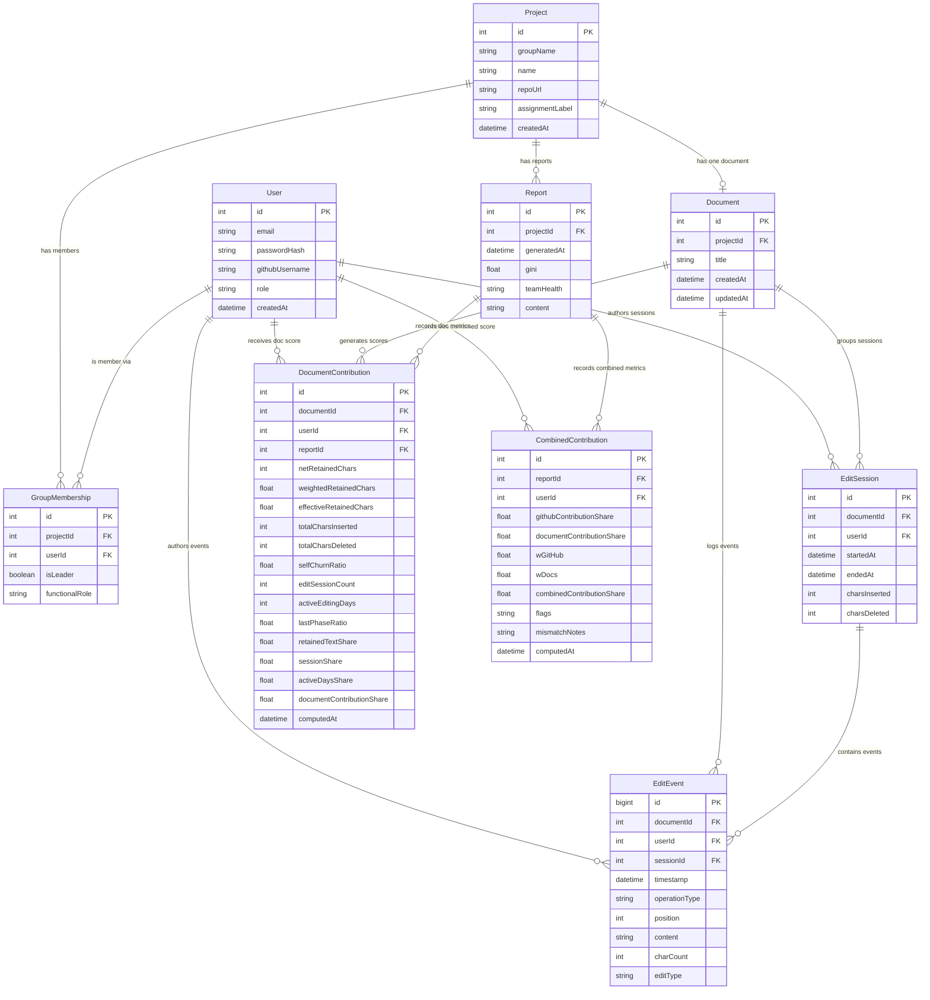

# FairTraze Docs — Design Blueprint & Manuscript Source

> **STATUS: PLANNED — NOT YET IMPLEMENTED.**
> This document is the authoritative design blueprint for FairTraze Docs, the system's planned built-in collaborative editor and its integration with GitHub-based scoring into a unified contribution fairness analysis. Nothing described here is currently in the codebase. The current build analyses GitHub only.
>
> Phase D is the implementation target. This document serves as design reference AND as manuscript source material for the capstone paper.

---

## Table of Contents

1. [Overview — The Dual-Source Thesis](#1-overview--the-dual-source-thesis)
2. [The FairTraze Docs Editor](#2-the-fairtraze-docs-editor)
3. [Net Retained Text — The Core Concept](#3-net-retained-text--the-core-concept)
4. [Document Scoring — Full Detail](#4-document-scoring--full-detail)
5. [Combined Scoring — GitHub + Docs](#5-combined-scoring--github--docs)
6. [Flags and Team Health for Docs and Combined](#6-flags-and-team-health-for-docs-and-combined)
7. [How Document Analysis Is Triggered](#7-how-document-analysis-is-triggered)
8. [Database Additions and Entity-Relationship Diagram](#8-database-additions-and-entity-relationship-diagram)
9. [New Modules and Components](#9-new-modules-and-components)
10. [New Use Cases by Actor](#10-new-use-cases-by-actor)
11. [Program Workflow and Data Flow](#11-program-workflow-and-data-flow)
12. [Roles Activation — The Documentation Role Comes Alive](#12-roles-activation--the-documentation-role-comes-alive)
13. [Privacy and Visibility](#13-privacy-and-visibility)
14. [Integration with Existing Systems](#14-integration-with-existing-systems)
15. [Concurrent-Edit Attribution Rule](#15-concurrent-edit-attribution-rule)
16. [Integrity Notes](#16-integrity-notes)
17. [Known Limitations](#17-known-limitations)

---

## 1. Overview — The Dual-Source Thesis

### What FairTraze Docs Is

FairTraze Docs is a collaborative writing environment built directly into the FairTraze AI platform. It is not an integration with Google Docs, Microsoft Word Online, or any third-party tool. It is a first-party, browser-based editor where student groups write and maintain their project documentation — proposals, reports, design documents, analyses, or any written deliverable the instructor assigns — with all editing activity recorded and attributed to the individual team member who performed it.

Every character typed, every deletion made, every edit session opened is permanently linked to the logged-in user account. This creates a rich, per-member activity record that the FairTraze AI scoring engine can analyse in the same rigorous, deterministic way it already analyses GitHub commit history.

### Why It Exists — The Gap in GitHub-Only Analysis

The current FairTraze AI system analyses GitHub repositories. GitHub is an excellent signal for measuring technical coding contributions: commits, lines of code, active development days, and commit patterns all reflect how much and how steadily each team member contributed to the codebase.

But many student project teams include members whose primary contribution is not code. A documentation lead writes the project proposal, the design specification, and the final report. A researcher synthesises literature and writes the background section. A project coordinator drafts meeting notes and maintains the project wiki. None of this work appears in Git history. Under a GitHub-only analysis, these members look like free-riders — their contribution scores are near zero not because they did nothing, but because the system is looking in the wrong place.

This is the fundamental gap. FairTraze Docs closes it.

### The Dual-Source Thesis

The thesis of the combined system is straightforward: **a fair contribution assessment for a software engineering project must account for both code and documents.** These are the two primary forms of intellectual output in student project teams. GitHub captures code; FairTraze Docs captures writing. Together, they give the instructor a complete, evidence-based picture of each member's contribution — regardless of whether that member is primarily a developer, primarily a writer, or both.

This dual-source design is the central differentiator of FairTraze AI. It means a project team can have a clean, planned division of labour — some members coding, some writing — and the system will correctly represent each person's contribution rather than misclassifying writers as non-contributors.

### The Core Principle Is Preserved

The foundational rule of FairTraze AI applies equally to document analysis and to combined scoring:

> **The math scores; the AI explains.**

All contribution scores — net retained text, edit session counts, active editing days, self-churn ratios, Gini coefficients, team-health labels, and all flags — are computed **deterministically in code**. The AI (Gemini) reads those already-computed numbers and writes a plain-language narrative explaining what they mean. The AI never computes, estimates, or changes a number. It never assigns grades. This separation is preserved without exception across both data sources and the combined analysis.

---

## 2. The FairTraze Docs Editor

### The User Experience

When a student opens their project in FairTraze AI, they see a **Docs** tab alongside the existing GitHub analysis view. Clicking it opens the group's shared document — a single, live collaborative document for the entire group. Multiple members can be present and editing simultaneously, just as they would in Google Docs.

The experience is familiar: a clean rich-text editing surface with formatting controls (headings, bold, italic, lists, tables). Members can see each other's cursors moving in real time. Text written by each member is displayed in that member's colour (colour-coded authorship), so at a glance any reader can see who contributed which parts of the document.

This is not a simple text box. It is a full **rich-text collaborative editor** with real-time synchronisation across all connected clients.

### One Document Per Group

Each group has exactly one shared document per assignment. This is a deliberate design choice: the system analyses a single, definitive document — the group's actual project documentation — rather than a collection of loosely related files. This mirrors how GitHub analysis focuses on a single repository.

If an assignment requires multiple documents (e.g., proposal + final report), the instructor creates multiple assignments, each with its own document. The system does not support multi-document analysis within a single assignment in the initial implementation.

### Per-Character Authorship — The Conceptual Model

The most important technical property of FairTraze Docs is **per-character authorship**: every character in the document is permanently attributed to the member who inserted it. When Anna types "The proposed system uses a microservices architecture", each of those 51 characters carries Anna's identity tag. If Ben later edits that sentence and changes "microservices" to "layered monolithic", the original characters remain attributed to Anna, and Ben's replacement characters are attributed to Ben.

This is the conceptual model. It enables:
- **Colour-coded authorship display** — the editor renders each member's text in their assigned colour, so the document is visually divided by contributor.
- **Net retained text calculation** — at analysis time, the system looks at the final document, reads the per-character authorship tags on every surviving character, and counts how many characters each member owns. This is the primary contribution signal.

### The Edit-Event Log — The Underlying Mechanism

Per-character authorship is a *model* — the meaningful abstraction. The *mechanism* that produces it is an **edit-event log**: a database table that records every insert and delete operation performed on the document, tagged with the acting user, a timestamp, the position in the document, and the content affected.

Every keypress, every paste, every deletion generates an event in this log. The log is the raw record. The per-character authorship view is derived from replaying or aggregating these events.

This two-layer design is standard in collaborative editing systems:
- **Live layer (Yjs CRDT):** The editor uses Yjs, a Conflict-free Replicated Data Type library, to manage real-time synchronisation between connected clients. Yjs maintains the document state in memory across all clients and handles concurrent edits without conflicts. Yjs natively supports per-author metadata on text ranges.
- **Persistent layer (edit-event log):** As edits flow through Yjs, a server-side hook writes each operation to the `EditEvent` database table. This creates a permanent, queryable, audit-grade record of every edit.

The Yjs document state is the source of truth for the live editor display (cursors, colour-coded text, real-time updates). The edit-event log is the source of truth for contribution analysis.

### Implementation Technology

| Component | Technology | Role |
|---|---|---|
| Rich-text editor | TipTap | Renders the editing surface, handles formatting, integrates with Yjs |
| Real-time sync | Yjs (CRDT) | Manages concurrent edits across all connected browsers without conflicts |
| Authorship metadata | Yjs `Y.Text` with attribute marks | Attaches userId to each inserted text range in the live document |
| Transport | WebSocket (via `y-websocket`) | Propagates edits between clients and server in real time |
| Persistence | PostgreSQL/SQLite via Prisma | Stores the edit-event log, sessions, and computed contribution data |

### Comments and Suggestions — Context Only, Not Scored

The editor supports comments (margin annotations on selected text) and suggestions (tracked-change-style proposed edits that can be accepted or declined by other members).

**Comments and suggestions do not count toward any contribution score.** They are preserved in the system as collaboration context — an instructor may wish to read them to understand group dynamics — but they are deliberately excluded from the scoring model. The reasons are:
1. Comments vary widely in nature: a three-word "looks good!" and a detailed three-paragraph critique would both count as one comment. Volume does not reflect quality.
2. Suggestions introduce a dependency between members (one suggests, another accepts), making attribution ambiguous.
3. Excluding them keeps the scoring model simple, transparent, and defensible.

If a member's sole contribution is comments and suggestions, their document contribution score will be low. The instructor must account for this manually, as they would for any contribution the system cannot measure.

---

## 3. Net Retained Text — The Core Concept

### The Simple Idea

The primary question FairTraze Docs answers is: **"At the end of the project, how much of the final document did each member actually write — and how much of that writing survived?"**

This is called **net retained text**: the characters each member inserted into the document that are still present in the document at analysis time, not characters that were later deleted or overwritten.

A member who types 10,000 characters but whose work is entirely replaced by teammates contributes very little to the final document, regardless of how many hours they spent typing. A member who types 2,000 characters of tight, substantive prose that no one changes contributes more. Net retained text measures the output that lasted — it rewards quality and persistence of contribution over raw volume.

This is the document-analysis equivalent of `meaningfulLines` in the GitHub model: both signals measure the contribution that stuck, rather than the raw activity that occurred.

### Worked Example

Consider a group of three members — Anna, Ben, and Carlos — working on a 1,000-character project report (simplified for illustration).

**During the project:**

| Member | Characters Inserted | Characters Deleted (own work) | Characters of theirs replaced by teammates |
|---|---|---|---|
| Anna | 600 | 50 | 100 |
| Ben | 800 | 400 | 150 |
| Carlos | 400 | 20 | 30 |

**At analysis time, the final 1,000-character document contains:**

| Member | Surviving Characters (Net Retained Text) |
|---|---|
| Anna | 600 − 50 − 100 = **450 chars** |
| Ben | 800 − 400 − 150 = **250 chars** |
| Carlos | 400 − 20 − 30 = **350 chars** |
| **Total** | **1,050 chars** *(small discrepancy from rounding — actual totals sum to final document length)* |

*Note: in the actual system the total surviving characters across all members equals the document length exactly, since every surviving character has exactly one author. The numbers above are illustrative approximations.*

**Net Retained Text Share:**
- Anna: 450 / 1,050 = **42.9%**
- Ben: 250 / 1,050 = **23.8%**
- Carlos: 350 / 1,050 = **33.3%**

Notice that Ben typed the most characters (800) but has the lowest net retained text share (23.8%). He deleted 400 of his own characters (high self-churn) and 150 were replaced by teammates. The score correctly reflects that Ben's final contribution to the document is smaller than his raw typing volume suggests.

### Why Not Count Total Characters Typed?

Counting raw characters typed would reward prolific typists and penalise careful writers. A member who drafts a section, realises it needs complete restructuring, deletes it, and rewrites it better has typed twice the characters of someone who wrote the same section well the first time — but their final contribution is identical. Net retained text avoids this distortion.

This is the same principle that motivates using `meaningfulLines` (net surviving lines of code) rather than raw lines added in the GitHub model. The measure that matters is the contribution that ended up in the final product.

---

## 4. Document Scoring — Full Detail

### Structure

Document scoring mirrors the GitHub scoring model in structural shape. There is one primary signal (analogous to meaningful lines), supplementary signals for activity rhythm and temporal behaviour, and a self-churn penalty. The formula produces a `documentContributionShare` for each member — a value between 0 and 1 that sums to 1 across all members.

### Signal 1 — Net Retained Text (Primary, Weight 0.4)

Net retained text, as described in Section 3, is the primary signal. It is computed from the edit-event log and the final document's per-character authorship map.

Before computing shares, each member's net retained text is **weighted by edit type**. Not all surviving characters contribute equally to the document's intellectual value. The system classifies each region of the document into one of four edit types based on the nature of the edit events that produced it:

| Edit Type | Weight | Description |
|---|---|---|
| Substantive | 1.0 | New arguments, original explanations, analysis, conclusions — content that adds intellectual value |
| Revision | 0.7 | Rewriting or meaningfully improving existing content — changing words, restructuring sentences, sharpening clarity |
| Formatting | 0.3 | Applying headings, bold, bullet points, table structure, spacing — structural markup with minimal prose content |
| Trivial | 0.1 | Single-character fixes, punctuation corrections, capitalisation |

This weighting scheme mirrors the commit-impact classification in GitHub scoring (structural/functional/cosmetic/trivial). Its purpose is the same: to prevent a member who spends their time formatting a document from appearing to contribute equivalently to a member who writes the substantive content.

**Weighted net retained text** for each member is:
```
weightedRetainedChars = Σ (retainedCharsInRegion × editTypeWeight)
```

**Net retained text share** for each member:
```
retainedTextShare = memberWeightedRetainedChars / Σ allMembersWeightedRetainedChars
```

### Signal 2 — Edit Sessions (Weight 0.2, Log-Scale)

An **edit session** is a continuous period of editing activity by one member. A session begins when a member opens the document and starts making edits and ends after a period of inactivity (30 minutes of no edit events). Sessions are the document equivalent of commits — they represent distinct contributions of effort.

Like commits in the GitHub model, raw session counts are passed through a **log scale** before normalisation to apply diminishing returns:

```
logSessions = Math.log(editSessions + 1)
sessionShare = memberLogSessions / Σ allMembersLogSessions
```

This means the difference between 1 and 5 sessions matters a lot; the difference between 40 and 44 sessions matters very little. A member who opens the document 100 times in the final hour to make tiny cosmetic edits gains far less advantage than the raw count would suggest.

### Signal 3 — Active Editing Days (Weight 0.2)

An **active editing day** is any calendar day on which the member made at least one edit event in the document. This is identical in definition and purpose to active days in the GitHub model.

Active editing days reward consistent participation over the project timeline. A member who contributes steadily across 10 days demonstrates a different engagement pattern than a member who produces the same net text in a single 6-hour session the night before the deadline.

```
activeDaysShare = memberActiveDays / Σ allMembersActiveDays
```

### Signal 4 — Self-Churn Penalty (Applied to Net Retained Text Signal)

**Self-churn** is the fraction of characters a member inserted that they later deleted themselves before those characters survived to the final version. High self-churn means a member wrote and rewrote the same passages repeatedly — the finished contribution is smaller than the editing effort suggests.

```
selfChurnRatio = charsInsertedThenDeletedBySelf / totalCharsInserted
effectiveWeightedChars = weightedRetainedChars × (1 − 0.5 × selfChurnRatio)
```

The penalty is capped at 50%: even a member with a selfChurnRatio of 1.0 (everything they typed they deleted) retains half their effective score. The penalty reflects inefficiency, not absence. Deleting *another member's* text does not affect the deleter's self-churn ratio.

This mirrors the GitHub scoring self-churn penalty exactly.

### The Document Scoring Formula

```
documentContributionShare =
    0.4 × retainedTextShare     (weighted net retained text, after self-churn)
  + 0.2 × sessionShare          (log-scaled edit sessions)
  + 0.2 × activeDaysShare       (distinct active editing days)
  + 0.2 × editTimingScore       (uniform distribution = 1.0; deadline-driven = lower)
```

*Edit timing score replaces the raw activeDays component in deadline analysis — see Section 6.*

### Worked Example — Full Document Scoring

**Team: Anna, Ben, Carlos. Three-week project.**

**Raw metrics collected from the edit-event log:**

| Member | Weighted Retained Chars | Self-Churn Ratio | Edit Sessions | Active Editing Days |
|---|---|---|---|---|
| Anna | 4,200 | 0.10 | 14 | 12 |
| Ben | 1,600 | 0.38 | 8 | 5 |
| Carlos | 3,100 | 0.12 | 11 | 9 |

**Step 1 — Apply self-churn penalty to retained text:**

```
Anna:   effectiveChars = 4,200 × (1 − 0.5 × 0.10) = 4,200 × 0.95 = 3,990
Ben:    effectiveChars = 1,600 × (1 − 0.5 × 0.38) = 1,600 × 0.81 = 1,296
Carlos: effectiveChars = 3,100 × (1 − 0.5 × 0.12) = 3,100 × 0.94 = 2,914
Total: 8,200
```

**Step 2 — Compute retained text shares:**
```
Anna:   3,990 / 8,200 = 0.4866
Ben:    1,296 / 8,200 = 0.1580
Carlos: 2,914 / 8,200 = 0.3554
```

**Step 3 — Apply log scale to edit sessions:**
```
Anna:   log(14 + 1) = log(15) = 2.708
Ben:    log(8  + 1) = log(9)  = 2.197
Carlos: log(11 + 1) = log(12) = 2.485
Total: 7.390

Anna:   2.708 / 7.390 = 0.3665
Ben:    2.197 / 7.390 = 0.2973
Carlos: 2.485 / 7.390 = 0.3362
```

**Step 4 — Compute active-days shares:**
```
Total active days: 12 + 5 + 9 = 26

Anna:   12 / 26 = 0.4615
Ben:    5  / 26 = 0.1923
Carlos: 9  / 26 = 0.3462
```

**Step 5 — Compute documentContributionShare (equal temporal distribution assumed):**
```
Anna:   0.4 × 0.4866 + 0.2 × 0.3665 + 0.2 × 0.4615 + 0.2 × 1.0
      = 0.1946 + 0.0733 + 0.0923 + 0.2 = 0.4602 → 46.0%

Wait — the 4th signal (editTimingScore) replaces the 4th weight slot. Let me recalculate with 3 signals summing to 1.0:

documentContributionShare =
    0.4 × retainedTextShare
  + 0.2 × sessionShare
  + 0.4 × activeDaysShare
```

*Note: In the standard (non-deadline) case, the formula weights are 0.4 (retained text) + 0.2 (sessions) + 0.4 (active days) = 1.0. When deadline-driven analysis is enabled, the active-days component is split and part of its weight is given to the edit-timing score.*

**Standard formula (0.4 / 0.2 / 0.4):**
```
Anna:   0.4 × 0.4866 + 0.2 × 0.3665 + 0.4 × 0.4615
      = 0.1946 + 0.0733 + 0.1846 = 0.4525  → 45.3%

Ben:    0.4 × 0.1580 + 0.2 × 0.2973 + 0.4 × 0.1923
      = 0.0632 + 0.0595 + 0.0769 = 0.1996  → 20.0%

Carlos: 0.4 × 0.3554 + 0.2 × 0.3362 + 0.4 × 0.3462
      = 0.1422 + 0.0672 + 0.1385 = 0.3479  → 34.8%

Check: 0.4525 + 0.1996 + 0.3479 = 1.0000 ✓
```

**Interpretation:** Anna is the lead contributor (45.3%), Carlos is a solid contributor (34.8%), Ben's contribution is notably lower (20.0%). With a 3-member team, the equal share is 33.3%. Ben is below 0.5 × 33.3% = 16.7% (the free-rider threshold), so he does not receive the free-rider flag in this scenario — his 20.0% is above the threshold. However, it may trigger an instructor review.

---

## 5. Combined Scoring — GitHub + Docs

### The Problem It Solves

Without combined scoring, a team where Anna codes and Ben writes would produce:
- GitHub analysis: Anna 100%, Ben 0% → Ben is flagged as a free-rider.
- Docs analysis: Anna 0%, Ben 100% → Anna is flagged as a free-rider.

Both flags are wrong. The team has a planned, clean division of labour. The system should recognise this and report it accurately.

Combined scoring solves this by computing each member's contribution separately in each source, then blending the results into a single score using an instructor-configurable weight.

### The Formula

For assignments with `sourceType = COMBINED`:

```
combinedContributionShare =
    wGitHub × githubContributionShare
  + wDocs    × documentContributionShare
```

**Default blend:** `wGitHub = 0.5`, `wDocs = 0.5` (50/50).

The blend weights are set by the instructor per assignment and must sum to 1.0. All flags, Gini coefficient, and team-health label are computed from `combinedContributionShare`. This ensures that the fairness assessment reflects the complete contribution picture.

### Worked Scenario — Anna and Ben

**Assignment:** `sourceType = COMBINED`, `wGitHub = 0.5`, `wDocs = 0.5`.

**Team of two:** Anna (developer) and Ben (documentation lead).

**GitHub contributions (Anna codes, Ben does not):**
```
githubContributionShare: Anna = 1.00, Ben = 0.00
```

**Document contributions (Ben writes, Anna does not):**
```
documentContributionShare: Anna = 0.00, Ben = 1.00
```

**Combined scores:**
```
Anna: 0.5 × 1.00 + 0.5 × 0.00 = 0.50  → 50%
Ben:  0.5 × 0.00 + 0.5 × 1.00 = 0.50  → 50%
```

**Result:** Both members score 50%. The equal share for a 2-person team is also 50%. No flags are raised. The Gini coefficient is 0 (perfect equality). Team health: Healthy.

The system correctly reflects a fair, planned division of labour. Neither member is wrongly flagged as a free-rider.

### Preventing Wrong Flags Through Combined Scoring

The four contribution flags (inactive, free-rider, overload, deadline-driven) are computed on the **combined score**, not on either source individually. This is critical.

If flags were computed per-source, Anna would be flagged as a free-rider in the document analysis (0% document contribution) and Ben would be flagged as a free-rider in the GitHub analysis (0% GitHub contribution). Both flags would be factually accurate about each source but conceptually wrong about each person's total contribution. Combined scoring prevents this.

The role/source mismatch note is separate and operates at the source level: if Anna is assigned the Developer role but has zero GitHub commits, the system surfaces a soft informational note to the instructor. This note never becomes a contribution flag and does not affect Anna's combined score. See Section 12.

### Instructor-Configurable Blend Weights

The 50/50 default is appropriate for teams where both coding and writing contributions are expected roughly equally. The instructor can adjust the blend for the specific nature of the assignment:

| Course Type | Suggested Blend | Rationale |
|---|---|---|
| Software Engineering (code-heavy) | `wGitHub = 0.70, wDocs = 0.30` | Code is the primary deliverable; documentation is required but secondary |
| Technical Writing with Prototype | `wGitHub = 0.30, wDocs = 0.70` | Writing quality is the primary assessed output |
| Balanced Capstone | `wGitHub = 0.50, wDocs = 0.50` | Both outputs carry equal weight |

**Example — Code-Heavy Course (70/30 blend), Same Anna/Ben scenario:**
```
Anna: 0.70 × 1.00 + 0.30 × 0.00 = 0.70  → 70%
Ben:  0.70 × 0.00 + 0.30 × 1.00 = 0.30  → 30%
```

Equal share = 50%. Ben is below 0.5 × 50% = 25%, so he is above the free-rider threshold (30% > 25%) — no flag. But the imbalance is visible: Anna holds 70% and Ben 30%. The Gini coefficient would be 0.20 (moderate) and team health: Moderate Risk. The instructor is informed of the imbalance and can investigate with the full context that Ben's contribution was entirely in documentation on a code-heavy assignment.

The blend weight is the instructor's tool for expressing the relative importance of each source type for a specific assignment. The system does not decide this autonomously.

---

## 6. Flags and Team Health for Docs and Combined

### The Same Four Flags

FairTraze Docs introduces no new flag types. The same four flags defined in the GitHub model apply to both document-only and combined analysis:

| Flag | Condition | Description |
|---|---|---|
| `inactive` | Member has zero contributions in the analysis window | No activity detected in either source (for COMBINED) |
| `free-rider` | combinedShare < 0.5 × equalShare | Contribution is less than half the equal share |
| `overload` | combinedShare > 1.75 × equalShare | One member is carrying a disproportionate share |
| `deadline-driven` | > 60% of edit events (or commits) occurred in the final third of the project timeline | Activity concentrated near the deadline |

### Critical Rule — Flags Are Based on Combined Score for COMBINED Projects

For `sourceType = COMBINED` assignments, **all flags are computed from `combinedContributionShare`**, not from either source individually. This is not optional — it is required for the system to function correctly.

If flags were computed per-source:
- A documentation lead with zero GitHub commits would always receive the `inactive` or `free-rider` flag from the GitHub analysis.
- A developer with zero document edits would always receive those flags from the document analysis.
- This would make COMBINED assignments unusable for teams with specialised roles.

By computing flags only on the combined score, the system correctly evaluates each member's total contribution across both sources.

### Gini Coefficient and Team Health

The Gini coefficient measures inequality in contribution distribution. It is computed from the `combinedContributionShare` values for all members and interpreted identically to the GitHub-only model:

| Gini Value | Team Health | Meaning |
|---|---|---|
| < 0.2 | Healthy | Contributions are reasonably balanced |
| 0.2 – 0.4 | Moderate Risk | Noticeable imbalance worth investigating |
| ≥ 0.4 | High Risk | Significant inequality — strong evidence of imbalance |

For COMBINED projects, the Gini calculation uses the blended combined score. A team where one member codes everything and another writes everything will have a Gini of 0 (after blending) if the blend weights are 50/50 — correctly indicating a healthy, balanced team.

### The Role/Source Mismatch Note — Separate from Flags

If a member's `functionalRole` implies activity in a source where they have none, the system surfaces a **soft informational note** to the instructor. This note:
- Is clearly labelled as context, not a flag.
- Does not affect any score.
- Does not appear in the flag list alongside `free-rider`, `overload`, etc.
- Prompts the instructor to investigate, not to take automated action.

Examples:
- Developer with zero GitHub commits → "NOTE: [Member] is assigned the Developer role but has no recorded GitHub commit activity in the analysis window."
- Documentation Lead with zero document edits → "NOTE: [Member] is assigned the Documentation Lead role but has no recorded document editing activity."

These notes activate only when the relevant source exists and is being analysed. Documentation Lead mismatch notes require FairTraze Docs to be active (Phase D). Developer mismatch notes are active now (current build).

### Deadline-Driven Detection for Documents

The `deadline-driven` flag for document activity follows the same logic as for GitHub:

- The project timeline is anchored to `[Assignment.startDate (or first recorded edit) → Assignment.deadline]`.
- The final third of this timeline is the "last phase".
- If more than 60% of a member's edit events occurred in the last-phase window, they receive the `deadline-driven` flag.
- For COMBINED assignments, the flag is triggered if either source (or the combined edit/commit distribution) shows this pattern.
- The AI narrative describes the pattern factually and non-accusatorily: "The majority of [Member]'s document edits occurred in the final week of the project timeline."

---

## 7. How Document Analysis Is Triggered

### The Architectural Difference

This is one of the most important architectural differences between GitHub analysis and document analysis.

**GitHub analysis requires an external fetch.** When an instructor clicks "Analyze" for a GitHub assignment, the server makes authenticated API calls to GitHub (via Octokit), retrieves commit history, fetches diff patches, classifies lines, and computes scores. The data lives in an external system. The analysis is triggered by the instructor's action.

**Document analysis reads from the local database.** Because FairTraze Docs is built into the platform, all edit events are written to the `EditEvent` table continuously and in real time as students work. By the time the instructor triggers an analysis, the complete editing history is already present in the database. No external API is called. No rate limits apply. The data is always available and always current.

This has several important implications:

| Property | GitHub Analysis | Document Analysis |
|---|---|---|
| Data location | External (GitHub servers) | Internal (FairTraze database) |
| External API calls | Yes (Octokit → GitHub REST API) | No |
| Rate limit risk | Yes (GitHub API rate limits) | No |
| Data availability | Only when GitHub is reachable | Always (local DB) |
| Latency | Variable (network + API) | Fast (local query) |
| Data currency | At-time-of-fetch | Continuously live |

### The Analysis Flow for Documents

1. The instructor clicks **"Analyze"** on a COMBINED or Docs-only assignment.
2. The server's document-analysis endpoint receives the request.
3. The `DocumentScoringEngine` queries the `EditEvent`, `EditSession`, and `Document` tables for the group's document.
4. It computes net retained text (by replaying the event log against the current authorship state), edit session counts, active editing days, self-churn ratios, and edit-timing distribution.
5. It applies edit-type weights and self-churn penalties.
6. It computes `documentContributionShare` for each member.
7. For COMBINED assignments, the `CombinedScoringEngine` blends this with the GitHub scores (fetched separately if not already cached).
8. Flags, Gini, and team health are computed from the combined scores.
9. The Gemini AI receives the already-computed numbers and writes the fairness narrative.
10. The combined `Report` is saved to the database.

### No "Sync" Step Required

Because edits are written to the database live, there is no equivalent of GitHub's repository-sync step. The analysis always reflects the document as it stands at the moment of analysis. If students edit the document after the analysis is run, the instructor can re-run the analysis to get a fresh result — the new edits will be included.

This is a deliberate design advantage: the instructor can run analysis at any point in the project lifecycle (mid-project check-in, final assessment) and always get an accurate snapshot.

---

## 8. Database Additions and Entity-Relationship Diagram

### Overview of New Tables

FairTraze Docs requires five new database tables. All new tables relate to the existing `Project` and `User` tables. In the target schema (Phase D and beyond), `Project` maps to `Group` and `User` replaces the flat `Member` table, but the relational structure is equivalent.

### New Table Definitions

---

#### `Document`

**Purpose:** Represents the single shared document for a group/project. One document per project.

| Field | Type | Description |
|---|---|---|
| `id` | `Int` (PK, auto-increment) | Primary key |
| `projectId` | `Int` (FK → Project.id, unique) | The group this document belongs to. Unique constraint enforces one document per project. |
| `title` | `String` | The document title (e.g., "Group 3 — Final Project Report") |
| `createdAt` | `DateTime` | When the document was first created |
| `updatedAt` | `DateTime` | Last modification timestamp (updated by Yjs sync hook on each save) |

Constraints: `projectId` is unique (one document per project). Cascade delete from Project.

---

#### `EditSession`

**Purpose:** Records a continuous editing session by one member in one document. Sessions are the document equivalent of commits — discrete units of contribution effort.

| Field | Type | Description |
|---|---|---|
| `id` | `Int` (PK, auto-increment) | Primary key |
| `documentId` | `Int` (FK → Document.id) | Which document this session belongs to |
| `userId` | `Int` (FK → User.id) | Which member was editing |
| `startedAt` | `DateTime` | When the session began (first edit event) |
| `endedAt` | `DateTime?` | When the session ended (30-min inactivity timeout; null if session is still active) |
| `charsInserted` | `Int` | Total characters inserted in this session |
| `charsDeleted` | `Int` | Total characters deleted in this session |

Indexes: `(documentId, userId)`, `(documentId, startedAt)`.

---

#### `EditEvent`

**Purpose:** The atomic record of every individual insert or delete operation in the document. This is the raw edit-event log — the mechanism underlying per-character authorship. Every keypress, paste, and deletion produces one or more rows in this table.

| Field | Type | Description |
|---|---|---|
| `id` | `BigInt` (PK, auto-increment) | Primary key. BigInt because high-volume documents may generate millions of events. |
| `documentId` | `Int` (FK → Document.id) | Which document this event belongs to |
| `userId` | `Int` (FK → User.id) | Which member performed the edit |
| `sessionId` | `Int` (FK → EditSession.id) | Which session this event belongs to |
| `timestamp` | `DateTime` | When the event occurred (millisecond precision) |
| `operationType` | `Enum (INSERT, DELETE)` | Whether characters were added or removed |
| `position` | `Int` | Character position in the document at the time of the edit |
| `content` | `String?` | The characters inserted (null for DELETE operations) |
| `charCount` | `Int` | Number of characters affected (positive for INSERT, positive for DELETE) |
| `editType` | `Enum (SUBSTANTIVE, REVISION, FORMATTING, TRIVIAL)` | Classification of the edit's intellectual weight — determined server-side by an edit classifier that analyses the surrounding document context |

Indexes: `(documentId, timestamp)`, `(documentId, userId)`, `(sessionId)`.

**Note on volume:** A 10,000-character document edited by 4 members over 3 weeks may produce 50,000–200,000 edit events. The BigInt primary key and appropriate indexes are essential. For very large documents or long projects, a compaction strategy (aggregating old events into session-level summaries) may be needed in future.

---

#### `DocumentContribution`

**Purpose:** Stores the computed contribution metrics for one member in one document analysis run. This is the document equivalent of the GitHub `ScoredMember` output — a cached, queryable record of the scoring computation.

| Field | Type | Description |
|---|---|---|
| `id` | `Int` (PK, auto-increment) | Primary key |
| `documentId` | `Int` (FK → Document.id) | Which document was analysed |
| `userId` | `Int` (FK → User.id) | Which member's metrics are recorded |
| `reportId` | `Int` (FK → Report.id) | Which report this computation belongs to |
| `netRetainedChars` | `Int` | Raw net retained character count (pre-weighting) |
| `weightedRetainedChars` | `Float` | Net retained characters after edit-type weighting |
| `effectiveRetainedChars` | `Float` | After self-churn penalty: `weightedRetainedChars × (1 − 0.5 × selfChurnRatio)` |
| `totalCharsInserted` | `Int` | Total characters inserted by this member across all time |
| `totalCharsDeleted` | `Int` | Total characters deleted by this member (own text) |
| `selfChurnRatio` | `Float` | `totalCharsDeletedOwnText / totalCharsInserted` |
| `editSessionCount` | `Int` | Number of distinct edit sessions |
| `activeEditingDays` | `Int` | Distinct calendar days with edit activity |
| `lastPhaseRatio` | `Float` | Fraction of edit events in the final third of the timeline |
| `retainedTextShare` | `Float` | Normalised share of weighted retained text (0–1) |
| `sessionShare` | `Float` | Normalised log-scaled session share (0–1) |
| `activeDaysShare` | `Float` | Normalised active-days share (0–1) |
| `documentContributionShare` | `Float` | Final weighted document contribution share (0–1) |
| `computedAt` | `DateTime` | When this record was computed |

Unique constraint: `(documentId, userId, reportId)` — one record per member per analysis run.

---

#### `CombinedContribution`

**Purpose:** Stores the blended combined contribution score for each member for a COMBINED assignment analysis run. This is the top-level record from which flags, Gini, and team health are computed.

| Field | Type | Description |
|---|---|---|
| `id` | `Int` (PK, auto-increment) | Primary key |
| `reportId` | `Int` (FK → Report.id) | Which report this belongs to |
| `userId` | `Int` (FK → User.id) | Which member |
| `githubContributionShare` | `Float` | The member's GitHub-source share (from the GitHub scoring engine) |
| `documentContributionShare` | `Float` | The member's document-source share (from DocumentContribution) |
| `wGitHub` | `Float` | The GitHub weight used for this run (instructor-set, e.g. 0.5) |
| `wDocs` | `Float` | The Docs weight used for this run (e.g. 0.5) |
| `combinedContributionShare` | `Float` | `wGitHub × githubShare + wDocs × documentShare` |
| `flags` | `String` (JSON array) | Computed flags: `["free-rider"]`, `["deadline-driven"]`, etc. |
| `mismatchNotes` | `String?` (JSON array) | Soft role/source mismatch notes for the instructor |
| `computedAt` | `DateTime` | When this record was computed |

Unique constraint: `(reportId, userId)` — one combined record per member per report.

---

### Entity-Relationship Diagram

The diagram below shows the new FairTraze Docs tables (shaded) and how they connect to the existing schema tables.



---

## 9. New Modules and Components

Four new software modules are required to implement FairTraze Docs. Each has a defined boundary and responsibility.

### Module 1 — The Editor Module (`client/src/components/DocsEditor/`)

**Responsibility:** Renders the collaborative rich-text editing surface in the browser and handles all real-time synchronisation between connected clients.

**What it does:**
- Mounts the TipTap editor with Yjs collaboration extension.
- Connects to the WebSocket server (via `y-websocket`) to join the shared document session.
- Applies per-user colour coding to text ranges based on the Yjs author metadata attached to each insert operation.
- Renders each connected member's cursor label in real time.
- Provides the toolbar (heading levels, bold, italic, lists, tables).
- Supports comments (margin annotations) and suggestions (tracked changes) — displayed only, not scored.
- On each local edit, attaches the current user's `userId` as metadata to the Yjs operation before broadcasting.

**Key components:**
- `DocsEditor.tsx` — main editor container, mounts TipTap and Yjs provider
- `AuthorshipMark.tsx` — TipTap mark extension that renders coloured text regions
- `CursorPresence.tsx` — renders remote member cursors and labels
- `CommentSidebar.tsx` — displays margin comments (context only)

**Does not contain:** scoring logic, session tracking, or database writes. Those belong to the server.

---

### Module 2 — The Live Authorship-Tracking Module (`server/src/lib/docsSync.ts`)

**Responsibility:** Intercepts Yjs operations on the server side and writes them as structured records to the database.

**What it does:**
- Runs as a WebSocket server (using `y-websocket` server library) that relays Yjs document updates between clients.
- On every incoming Yjs update message, extracts the operations (inserts and deletes), their positions, their content, and the associated `userId` from the client metadata.
- Writes each operation as one or more `EditEvent` rows to the database.
- Manages `EditSession` lifecycle: opens a new session when a user sends their first edit after a 30-minute gap; closes the previous session and records its end time.
- Does not perform any scoring computation — it only persists raw events.

**Key functions:**
- `handleYjsUpdate(documentId, userId, yjsUpdate)` — parses and stores edit events
- `openOrContinueSession(documentId, userId)` — manages session boundaries
- `classifyEditType(context)` — classifies each edit as SUBSTANTIVE, REVISION, FORMATTING, or TRIVIAL based on surrounding document context (heuristic: new paragraphs = SUBSTANTIVE; changes within existing text = REVISION; heading/list-structure only = FORMATTING; ≤2 chars changed = TRIVIAL)

---

### Module 3 — The Document Scoring Engine (`server/src/lib/documentScoring.ts`)

**Responsibility:** Reads the stored edit-event log and computes per-member document contribution scores. The document-analysis equivalent of `shared/src/scoring.ts`.

**What it does:**
- Queries all `EditEvent` and `EditSession` records for a document.
- Reconstructs the per-character authorship map: replays the event log to determine which characters in the final document were last written by which member.
- Computes `netRetainedChars`, `weightedRetainedChars`, `selfChurnRatio`, `editSessionCount`, `activeEditingDays`, and `lastPhaseRatio` for each member.
- Applies the edit-type weighting and self-churn penalty.
- Normalises all signals into shares.
- Computes `documentContributionShare` using the scoring formula.
- Writes results to `DocumentContribution`.
- Computes and returns flags (`inactive`, `free-rider`, `overload`, `deadline-driven`) based on document contribution shares.

**Does not:** call any external API, write to `Report` directly, invoke the AI, or modify any scoring parameters dynamically. It is fully deterministic.

---

### Module 4 — The Combined Scoring Engine (`server/src/lib/combinedScoring.ts`)

**Responsibility:** Blends GitHub and document scores into the final combined contribution score for COMBINED assignments.

**What it does:**
- Accepts the GitHub `ScoredMember` array (from the existing GitHub pipeline) and the `DocumentContribution` array (from the Document Scoring Engine) for the same group.
- Reads the assignment's `wGitHub` and `wDocs` blend weights.
- Computes `combinedContributionShare` for each member.
- Detects role/source mismatch and generates informational notes (not flags).
- Computes flags (`inactive`, `free-rider`, `overload`, `deadline-driven`) from the combined share.
- Computes the Gini coefficient from combined shares.
- Determines the team-health label.
- Writes results to `CombinedContribution`.
- Returns the full `TeamReport` structure (same shape as the existing GitHub-only report, extended with document and combined fields).

**Does not:** invoke the AI, compute any individual source scores, or modify the blend weights. Those are instructor-set inputs.

---

## 10. New Use Cases by Actor

### Student Use Cases (added by FairTraze Docs)

**UC-S-D1: Open and edit the group document**
- **Actor:** Student (any member)
- **Trigger:** Student clicks the "Docs" tab on their project view.
- **Flow:** The editor loads the current group document. The student can type, format, comment, and suggest. All edits are synchronised live to other connected members. Per-character authorship is captured automatically — the student takes no action to attribute their work. The student sees their own text in their assigned colour.
- **Result:** Edit events are written to the database. The document reflects the student's contribution in real time.

**UC-S-D2: View own document contribution summary (Phase C)**
- **Actor:** Student
- **Trigger:** Student navigates to their personal dashboard.
- **Flow:** The student sees their own document metrics: edit sessions, active editing days, net retained text percentage, and their document contribution share. They do not see other members' individual metrics.
- **Result:** The student has a factual self-assessment of their document contribution.

**UC-S-D3: View own combined contribution (Phase C, COMBINED assignments)**
- **Actor:** Student
- **Trigger:** Student views the combined contribution report for their group.
- **Flow:** The student sees their `combinedContributionShare` and its breakdown (GitHub share + document share at the configured weights). They do not see teammates' individual scores.
- **Result:** The student understands how their combined contribution is assessed.

**UC-S-D4: Dispute a document or combined contribution assessment (Phase C)**
- **Actor:** Student
- **Trigger:** Student believes the assessment does not reflect their actual contribution.
- **Flow:** Same as the existing GitHub dispute workflow — student clicks "Flag for review", writes a short note (e.g., "I typed up the methodology section from notes taken during our group meeting"), and submits. The instructor receives a notification.
- **Result:** A `Dispute` record is created. The instructor reviews and applies their professional judgment.

---

### Instructor Use Cases (added by FairTraze Docs)

**UC-I-D1: View the document contribution report**
- **Actor:** Instructor
- **Trigger:** Instructor runs analysis on a Docs or COMBINED assignment.
- **Flow:** The report displays per-member document metrics: net retained text percentage, edit sessions, active editing days, self-churn ratio, and `documentContributionShare`. Flags and mismatch notes are shown. The AI narrative explains the pattern in plain language.
- **Result:** The instructor has an evidence-based assessment of each member's document contribution.

**UC-I-D2: View the combined contribution report (COMBINED assignments)**
- **Actor:** Instructor
- **Trigger:** Instructor runs analysis on a COMBINED assignment.
- **Flow:** The report shows GitHub contribution, document contribution, and combined contribution side by side for each member. Flags are based on combined scores. The blend weights used are shown. The Gini coefficient and team-health label reflect the combined picture.
- **Result:** The instructor has a complete, dual-source contribution assessment.

**UC-I-D3: Configure the source blend weight**
- **Actor:** Instructor
- **Trigger:** Instructor creates or edits an assignment.
- **Flow:** A slider or input pair lets the instructor set `wGitHub` and `wDocs` (constrained to sum to 1.0). The current selection is shown (e.g., "70% GitHub, 30% Docs"). The default is 50/50. The instructor saves the assignment.
- **Result:** All subsequent analyses for this assignment use the configured weights.

**UC-I-D4: View the group document as context**
- **Actor:** Instructor
- **Trigger:** Instructor opens the document view from the group analysis page.
- **Flow:** The instructor sees the colour-coded document showing each member's surviving text in their colour. This is a read-only contextual view — not the live editor. The instructor can scroll through the document and visually verify the authorship picture.
- **Result:** The instructor has a qualitative complement to the quantitative metrics.

---

## 11. Program Workflow and Data Flow

### Phase 1 — Document Creation (Instructor/System)

1. Instructor creates an assignment with `sourceType = COMBINED` (or `EDITOR`), sets `deadline`, and optionally configures blend weights.
2. The system automatically creates a `Document` record for each group under the assignment when the group is formed. The document starts empty.

### Phase 2 — Live Collaborative Editing (Students, ongoing)

3. A student opens the Docs tab → client loads the TipTap editor and connects to the Yjs WebSocket server.
4. The student begins typing. Each keystroke generates a Yjs insert operation with the student's `userId` as metadata.
5. The Yjs WebSocket server relays the operation to all other connected clients → they see the new text appear in the author's colour in real time.
6. Simultaneously, the server's `docsSync` module intercepts the Yjs operation and:
   a. Determines whether a new `EditSession` should be opened (30-min inactivity rule) or the current session continued.
   b. Classifies the edit type (SUBSTANTIVE, REVISION, FORMATTING, TRIVIAL) based on document context.
   c. Writes one or more `EditEvent` rows to the database.
7. This process repeats for every edit by every member throughout the project lifetime. The database accumulates a complete, chronological edit history.

### Phase 3 — Instructor Triggers Analysis

8. The instructor opens the group analysis page and clicks **"Analyze"**.
9. The server receives the analysis request for a COMBINED assignment.

### Phase 4 — GitHub Scoring (Parallel)

10. The existing GitHub pipeline runs:
    - Octokit fetches commit history, diff patches, and contributor statistics.
    - `lineClassifier.ts` classifies added lines.
    - `fileWeights.ts` and `commitClassifier.ts` apply significance weights.
    - `scoring.ts` computes `githubContributionShare` for each member.
11. GitHub scores are held in memory pending the document analysis.

### Phase 5 — Document Scoring

12. The `DocumentScoringEngine` queries all `EditEvent` and `EditSession` records for this group's document.
13. It replays the event log to reconstruct the per-character authorship map of the final document.
14. For each member, it computes: `netRetainedChars`, `weightedRetainedChars`, `selfChurnRatio`, `editSessionCount`, `activeEditingDays`, `lastPhaseRatio`.
15. It applies edit-type weighting and self-churn penalty → `effectiveRetainedChars`.
16. It normalises each signal into shares (`retainedTextShare`, `sessionShare`, `activeDaysShare`).
17. It computes `documentContributionShare` for each member.
18. It writes `DocumentContribution` records to the database.

### Phase 6 — Combined Scoring

19. The `CombinedScoringEngine` receives both score sets: GitHub and document.
20. It applies the assignment's blend weights: `combinedShare = wGitHub × githubShare + wDocs × documentShare`.
21. It detects role/source mismatches → generates informational notes.
22. It computes flags (`inactive`, `free-rider`, `overload`, `deadline-driven`) from `combinedContributionShare`.
23. It computes the Gini coefficient from combined shares.
24. It assigns the team-health label.
25. It writes `CombinedContribution` records.

### Phase 7 — AI Narrative

26. The server constructs a structured prompt for the Gemini AI containing:
    - All already-computed numbers: combined scores, source-specific scores, flags, Gini, team health.
    - Assignment context: deadline, blend weights, member count.
    - Role/source mismatch notes.
27. Gemini writes a plain-language fairness narrative explaining the numbers. It does not compute, estimate, or change any number. It does not assign grades.
28. The narrative is appended to the report payload.

### Phase 8 — Report Saved and Displayed

29. A `Report` record is written linking the group, the computed data, and the AI narrative.
30. The instructor sees the full report: combined contribution chart, per-member breakdown (GitHub + document + combined), flags, mismatch notes, team health, and the AI narrative.
31. The colour-coded document view is accessible as supplementary context.

---

## 12. Roles Activation — The Documentation Role Comes Alive

### Current State (GitHub only)

The `functionalRole` field on `GroupMembership` is already persisted in the database. A member can be assigned "Developer", "Documentation Lead", or any other label. However, with only GitHub analysis active, the Documentation Lead mismatch check cannot fire — there is no document source to compare against. The role is stored but partially inert.

### After Phase D — What Activates

Once FairTraze Docs is implemented and a group has an active document, the system gains the ability to check whether a Documentation Lead has document editing activity.

**The check:** If a member's `functionalRole` contains "Documentation Lead" (or equivalent) and their `documentContributionShare` is zero (or below a minimal threshold — e.g., fewer than 3 active editing days), the system generates a mismatch note:

> "NOTE: [Member] is assigned the Documentation Lead role but has no recorded document editing activity in the analysis window."

**What the note does:**
- Surfaces in the instructor's combined report as a soft, context-only annotation.
- Does not affect any score.
- Is clearly labelled as informational, not a flag.
- Prompts the instructor to investigate — perhaps the member contributed offline, or the role was mis-assigned.

**What the note does not do:**
- It does not apply the `inactive` or `free-rider` flag.
- It does not re-weight the member's score.
- It does not reduce the member's `combinedContributionShare`.

### The Symmetry

Both source-presence mismatch checks now work:
- **Developer** (GitHub role) with no GitHub commits → "NOTE: no recorded GitHub commit activity." (Active now, current build.)
- **Documentation Lead** (document role) with no document edits → "NOTE: no recorded document editing activity." (Active in Phase D.)

For members with roles that imply both sources (Project Manager, Coordinator) or roles with no platform trace (Researcher), no mismatch check fires. The system only checks sources it can observe.

---

## 13. Privacy and Visibility

FairTraze Docs follows the same privacy model as the existing system, extended consistently for the new data source.

### Student Visibility

A student can see:
- The full content of the group's shared document (they are a contributor to it).
- The colour-coded authorship view of the document — including which text belongs to which member — because this is the same view everyone editing the document sees live.
- Their own `documentContributionShare` and `combinedContributionShare` on their personal dashboard.
- Their own metrics: net retained text %, edit sessions, active editing days, self-churn ratio.
- Any flags applied to their own combined score.

A student cannot see:
- Another member's individual `documentContributionShare` or metric breakdown.
- Another member's flag status.
- The full team-level Gini coefficient or team-health label (those are instructor-facing).

### Instructor Visibility

An instructor can see:
- All members' document contribution metrics and combined scores.
- All flags and mismatch notes for all members.
- The Gini coefficient and team-health label.
- The AI narrative.
- The colour-coded document view for qualitative context.

### Group Leader (Coordination View)

The group leader has access to a **participation status view** — a lightweight summary showing whether each member has opened the document and whether they have made any edit sessions. This is a binary presence indicator (has participated / has not participated), not a full metric breakdown. The purpose is coordination: the leader can see if a member has not opened the document at all and follow up. The leader does not see specific scores or character counts for teammates.

---

## 14. Integration with Existing Systems

FairTraze Docs does not create a parallel reporting system. It plugs directly into the existing infrastructure.

### The Report Table

The existing `Report` table remains the single record of an analysis run. Document and combined analysis results are stored in the `DocumentContribution` and `CombinedContribution` tables, both linked to the same `Report.id`. The `Report.content` field contains the AI narrative (unchanged from current). The `Report.gini` and `Report.teamHealth` fields are populated from the combined scores rather than GitHub-only scores for COMBINED assignments.

### Alerts (Phase F Integration)

The existing alert system (planned for Phase F) monitors contribution balance and triggers notifications when at-risk patterns emerge. For COMBINED assignments, alerts are based on `combinedContributionShare`. A Documentation Lead with a low combined score (e.g., low document contribution and no GitHub activity) would trigger the same at-risk alert as a developer with low commit activity. The alert mechanism is source-agnostic — it operates on the combined number.

### Student Dispute Workflow (Phase C Integration)

The dispute workflow added in Phase C allows students to add a note to their contribution report for the instructor's review. This workflow is unchanged for document and combined analysis. A student who believes their document contribution score is inaccurate (e.g., they typed up content authored collaboratively offline) submits the same "Flag for review" action. The instructor receives the note alongside the full metric breakdown and exercises professional judgment.

No new dispute pathway is introduced for document-specific disputes. The single, unified dispute mechanism handles all sources.

---

## 15. Concurrent-Edit Attribution Rule

### The Challenge

When multiple members are editing the document simultaneously — which is the designed experience — two members may edit the same section of text at nearly the same moment. Yjs (CRDT) resolves these edits deterministically at the character level, producing a consistent document across all clients. But who gets credit for which characters when edits interleave?

### The Rule

**Credit is assigned by final surviving characters, determined by per-character authorship as tracked in the Yjs document state.**

Specifically:
- Each character in the final document has a Yjs author tag recording who last inserted that character.
- If Member A types "architecture" and Member B then selects it and types "design" in its place, Member B's six characters replace Member A's twelve. In the final document, those six characters carry Member B's author tag. Member A receives credit for zero surviving characters at that position; Member B receives credit for six.
- If Member A types "The" and Member B simultaneously types " system" at the adjacent position, and Yjs resolves this as "The system", both contributions are attributed correctly: "The" to A, " system" to B.
- Yjs's CRDT resolution algorithm (based on logical timestamps and user IDs as tiebreakers) is deterministic and consistent across all clients. The server-side authorship record matches what every client sees.

### What This Does Not Cover

This rule governs character-level attribution in the live editor. It does not resolve:
- **Offline work typed by a delegate:** A member who types content written by another member (e.g., from notes taken in a meeting) receives the typist credit. See Known Limitations.
- **Large concurrent restructures:** If two members simultaneously rewrite large portions of the same section, Yjs resolves the conflict, but the resulting attribution may not reflect the intended authorship. The system surfaces what the data shows; the instructor investigates.

---

## 16. Integrity Notes

### Stronger Identity Assurance than GitHub

The GitHub analysis relies on `githubUsername` — a value each member self-registers on their FairTraze AI account. While this is a good-faith mechanism, a member could theoretically register the wrong username (accidentally or deliberately) and have their contribution misattributed.

FairTraze Docs does not have this vulnerability. **Document editing activity is tied directly to the logged-in FairTraze AI account.** When a member edits the document, the edit event is written with their `User.id` from the authenticated session. There is no self-registration of a separate identifier. A member cannot make edits attributed to someone else — only their own logged-in account can generate edit events under their name.

This makes the document contribution data the more integrity-robust of the two sources. The combined system benefits from this: even if GitHub attribution is slightly noisy (due to username mis-registration or shared machines), the document source provides a clean, account-anchored signal.

### One Document, One Group

The single-document-per-group design prevents a member from creating a separate document and inflating their scores by editing it in isolation. All editing must occur in the single shared document that is linked to the group's assignment. The system does not score any other document.

### Temporal Immutability of the Event Log

Edit events are written to the database at the time they occur and are never modified. The log is append-only from the perspective of the application. This means the authorship history cannot be retroactively altered — a member cannot go back and re-attribute past work. The analysis always reflects what actually happened.

---

## 17. Known Limitations

These are documented limitations of the current design, stated openly for the capstone paper and for instructor awareness. They are not implementation bugs; they are measurement boundaries that the instructor must account for.

### 1. Copy-Paste and Pasted AI-Generated Text

When a member pastes a large block of text — whether copied from another source, generated by an AI tool (e.g., ChatGPT), or transferred from a separate draft — the paste registers as a large insert operation attributed to the member who performed the paste. The system has no way to distinguish original prose from a paste without additional signals.

**Planned mitigation (not yet implemented):** Bulk-paste detection using character-velocity thresholds. A member who inserts 2,000 characters in a single operation with zero preceding keystrokes is a statistical outlier. The system can flag this as a potential bulk-paste and dampen its contribution weight. The policy for handling confirmed pastes (especially AI-generated content) is not yet designed and requires institutional guidance.

**Current state:** Pasted text is credited to the pasting member at full weight. The instructor must review the document qualitatively if they suspect bulk paste behaviour.

### 2. Typist Credit

A member may type content that was authored collaboratively offline — for example, typing up decisions from a meeting, or transcribing a teammate's dictated analysis. In this case, the typist receives full authorship credit in the system, even though the intellectual content originated elsewhere.

This is the same limitation that affects Git commits attributed to the committer even when work was done collaboratively (pair programming, code review, verbal design discussions). The system credits the person who made the recorded action.

**Resolution:** There is no automated fix for typist credit. The system surfaces what it can measure. Students can use the dispute workflow (Phase C) to explain offline or dictated contributions. Instructors must account for this limitation in their assessment.

### 3. Concurrent-Edit Attribution Edge Cases

The concurrent-edit attribution rule (Section 15) is deterministic but produces results based on the Yjs CRDT resolution, which prioritises one member's characters over another's using logical timestamps and user-ID tiebreakers. In high-contention concurrent edits — two members rewriting the same paragraph simultaneously — the resulting attribution may not reflect the members' intended contributions.

**Example edge case:** Anna and Ben both select a badly written sentence and begin rewriting it simultaneously. Yjs resolves this by keeping one member's rewrite and discarding the other's, based on the CRDT timestamp. The winning member gets credit for the surviving text; the losing member's work is discarded at the CRDT level and does not appear in the event log as retained characters. Their effort was real; the system cannot see it.

**Mitigation:** This edge case is unlikely to dominate any member's score in practice — it affects individual sentences during simultaneous edits. However, it is a known measurement gap. The instructor can view the document and read the edit history to investigate specific cases.

### 4. Edit-Type Classification Accuracy

The `classifyEditType` function uses heuristics based on document context to classify edits as SUBSTANTIVE, REVISION, FORMATTING, or TRIVIAL. These heuristics are rule-based and imperfect. An elaborate table format might be classified as FORMATTING when it contains substantive content in its cells. A one-sentence paragraph addition might be classified as TRIVIAL if it is short.

The classification affects the edit-type weighting of net retained text but does not override the core authorship attribution. Misclassification affects the weight of a contribution, not whether it is counted. The impact is bounded: a SUBSTANTIVE edit mis-classified as FORMATTING is down-weighted to 0.3× instead of 1.0×, but it is still counted.

**Resolution:** The classification heuristics should be refined over time based on observed patterns. They are documented as heuristics, not ground truth. The instructor can request a re-analysis with adjusted weights if they believe the classification is systematically off for a particular assignment type.

---

*End of FAIRTRAZE_DOCS.md — FairTraze AI Capstone Design Blueprint.*

*Document version: 1.0 | Status: PLANNED — Phase D | Author: Design team | Date: June 2026*
